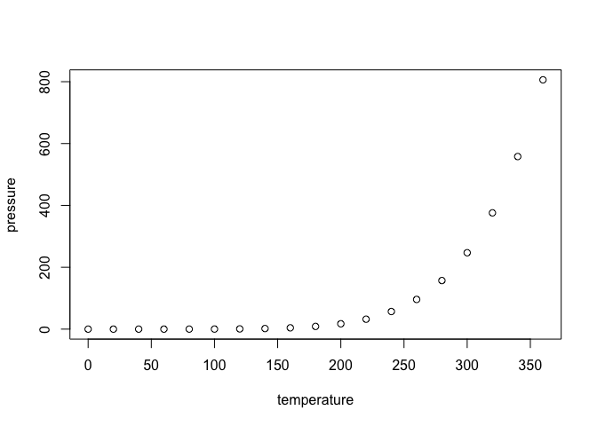
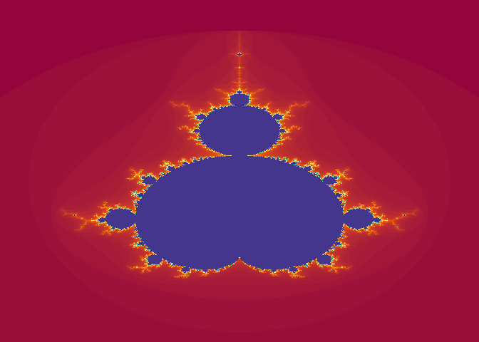

question_9
================
2025-09-16

## R Markdown

This is an R Markdown document. Markdown is a simple formatting syntax
for authoring HTML, PDF, and MS Word documents. For more details on
using R Markdown see <http://rmarkdown.rstudio.com>.

When you click the **Knit** button a document will be generated that
includes both content as well as the output of any embedded R code
chunks within the document. You can embed an R code chunk like this:

``` r
summary(cars)
```

    ##      speed           dist       
    ##  Min.   : 4.0   Min.   :  2.00  
    ##  1st Qu.:12.0   1st Qu.: 26.00  
    ##  Median :15.0   Median : 36.00  
    ##  Mean   :15.4   Mean   : 42.98  
    ##  3rd Qu.:19.0   3rd Qu.: 56.00  
    ##  Max.   :25.0   Max.   :120.00

## Including Plots

You can also embed plots, for example:

<!-- -->

Note that the `echo = FALSE` parameter was added to the code chunk to
prevent printing of the R code that generated the plot.

# Section 1

This is a very complicated code where we use functions like `outer()`
and `contour()`. We also use a red color that is very pretty. Remember
assignments are done with `<-`. Enjoy.

``` r
x <- seq(-2, 2, 0.005)
y <- seq(-2, 2, 0.005)
z <- outer(x, y, function(x, y) (x^2 + y^2 - 1)^3 - x^2 * y^3)
contour(x, y, z, levels = 0, drawlabels = FALSE, col = "red", lwd = 3, asp = 1, axes = FALSE)
```

<!-- -->

# Section 2

This section will show you a fractal. Because apparently drawing circles
and squares wasn’t “complicated enough.” The real fun is zooming in on
the edges, where you’ll discover that the same little bug-shaped thing
just keeps reappearing, again and again, like some cosmic screensaver
that never stops.

``` r
mandelbrot <- function(xlim = c(-2.3, 1.1), ylim = c(-1.5, 1.5),
                       res = 900, iter = 120) {
  x <- seq(xlim[1], xlim[2], length.out = res)
  y <- seq(ylim[1], ylim[2], length.out = res)
  C <- outer(x, y * 1i, `+`)        # complex grid
  Z <- matrix(0+0i, res, res)
  K <- matrix(iter, res, res)

  for (k in 1:iter) {
    Z <- Z^2 + C
    escaped <- (K == iter) & (Mod(Z) > 2)
    K[escaped] <- k
  }

  op <- par(mai = c(0,0,0,0))
  image(x, y, t(K)[, res:1], col = hcl.colors(iter, "Spectral"), axes = FALSE)
  par(op)
}

mandelbrot()
```

<!-- -->
